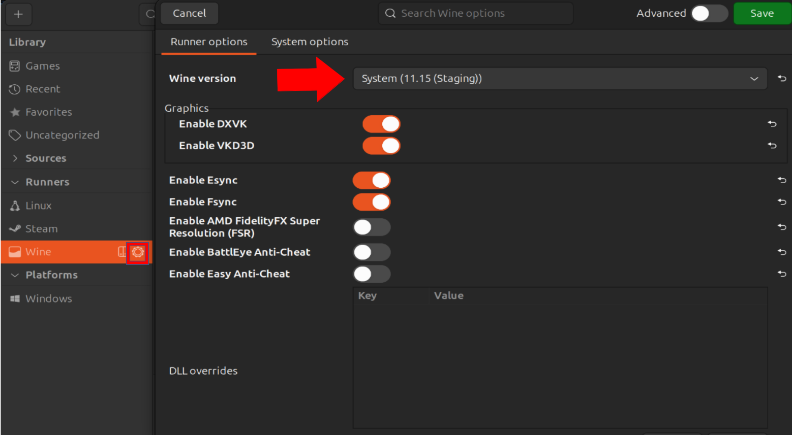
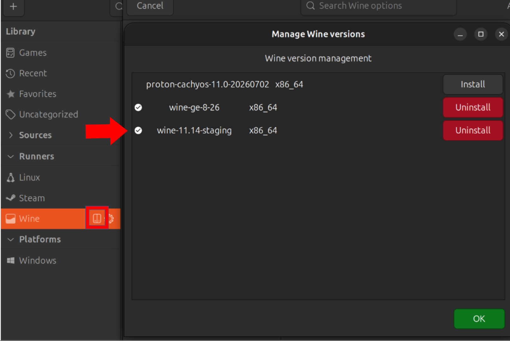
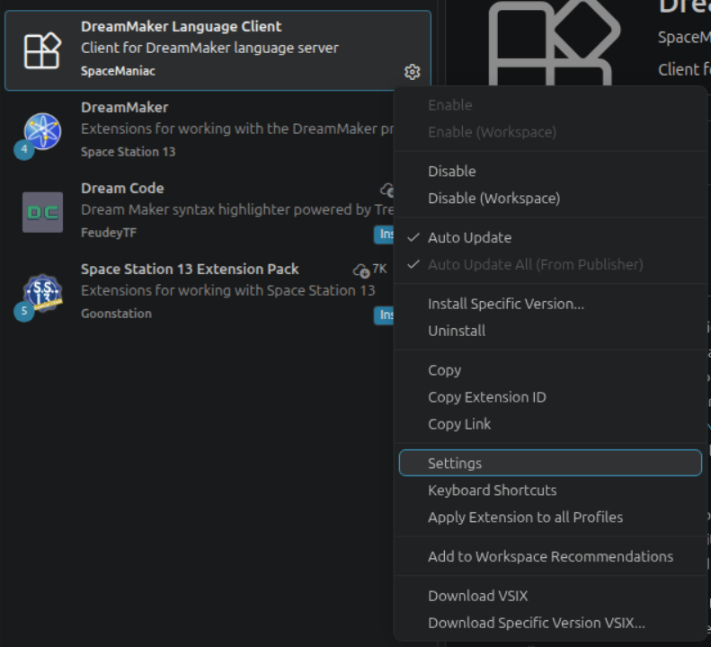
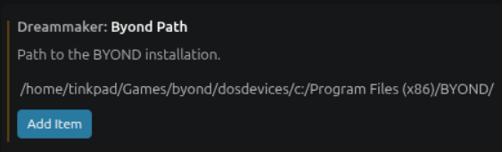

# Wine-Byond-help
A collection of tips and tricks for getting byond running on linux<br />

This guide is based on the [Lutris](https://lutris.net/games/byond/) installer
## If you are running into issues with the lutris install script, check if the x64byond.yaml works, as it is normally more up to date.<br > 
# Please do not use the default Proton-Ge wine provided with lutris, Use wine 11.14 (staging)
webview2 requires patches made to wine in 10.5. Proton is based on 10.0, so until the wine patches are ported to GE or proton gets rebased to 11.0, please use a system wine (11.14) instead.
<br /> <br />

<br /> <br />
to do so in lutris before running the install script please press the wine button on the left side tab and then select system wine as default <br />
make sure the wine is newer then 11.0. to install, please google your distro's guide for installing wine to update it (use staging-wine)<br />

<br />
arch: https://wiki.archlinux.org/title/Wine<br />
others: https://gitlab.winehq.org/wine/wine/-/wikis/Download<br />

<br />
**alternatively if your package manager does not eaisly provide a sufficent wine version**<br />
you can press the small box icon and have lutris install some specfic wine versions. 11.14 is recommended as its provides the best performance enhancing patches and supports NTSync which may (needs testing) improve byond performance in some facets.
TODO: test NTsync and add a guide for setting it up.


TODO: add guides for bottles and other installers<br />

# [Trouble shooting tips](issues.md)


# Setting up Visual Studio Code develeopment.
Byond on wine  works well enough for development. 
Please note:
* VSC was tested on **wine 11.14 staging**
* Debugging and breakpoints work only up to **byond version 516.667**. [Extension github](https://github.com/SpaceManiac/SpacemanDMM)
* VSC uses **system wine only**.

## setting up extension and settings

1.  Download [DreamMaker extensions](https://marketplace.visualstudio.com/items?itemName=ss13.byond) in vsc. Go to DreamMaker language client settings 

2. To get path, open lutris and select BYOND
3. right click to **configure BYOND**
4. select **game options**
5. while your in **game options** copy the and save the **wine prefix path**
6. copy path of executable. **Remove the last bin/byond.exe part**, and then paste it into in VSC setting.


## Launch.json and correct wine prefix:
1. In visual studio code, **open the run and debug menu**
2. click **create a launch.json** file
3. select BYOND as the type if it asks.
4. Using wine prefix from last step, add 
it to **both launch config options** like so: 
    ```json
    ...
    "env": {
        "WINEPREFIX" : "<YOUR PREFIX HERE>",
    }
    ...
    ```
It should look something like this:
```json
{
    "version": "0.2.0",
    "configurations": [
        
        {
            "type": "byond",
            "request": "launch",
            "name": "Launch DreamSeeker",
            "preLaunchTask": "dm: build - ${command:CurrentDME}",
            "env": {
                "WINEPREFIX" : "/home/tinkpad/Games/byond/",
                },
            "dmb": "${workspaceFolder}/${command:CurrentDMB}",
        },
        {
            "type": "byond",
            "request": "launch",
            "name": "Launch DreamDaemon",
            "preLaunchTask": "dm: build - ${command:CurrentDME}",
            "dmb": "${workspaceFolder}/${command:CurrentDMB}",
            "env": {
                "WINEPREFIX" : "/home/tinkpad/Games/byond/",
                },
            "dreamDaemon": true
        }
    ]
}
```
## checking if binfmt_misc is working.
try to launch the game, if you get an **OS ERROR 8**, you need to setup binfmt_misc to open exe's. **this guide works with Debian**, On other systems, it might be different.
1. ensure binfmt_misc is operational 
    ```bash
    cat /proc/sys/fs/binfmt_misc/status 
    # enabled
    ```
2. configure exe to use wine and restart binfmt service
    ```bash
    echo :DOSWin:M::MZ::/usr/bin/wine: | sudo tee  /etc/binfmt.d/wine.conf && sudo systemctl restart systemd-binfmt
    ```
3. verify exe is configured 
    ```bash
    cat /proc/sys/fs/binfmt_misc/DOSWin
    # enabled 
    ```
4. try to compile and launch game through vsc, report issues to this github.